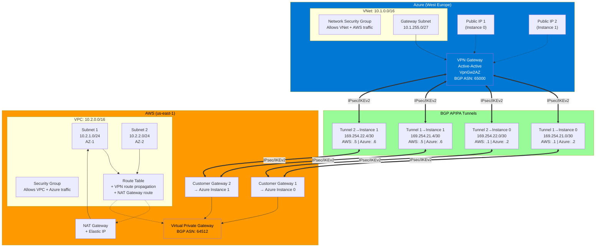

# Azure-AWS Site-to-Site VPN with BGP

This Terraform project creates a highly available, BGP-enabled site-to-site VPN connection between Azure and AWS, following Microsoft's official documentation.

## Architecture



### Key Components

**Azure Side:**
- Active-active VPN Gateway with 2 instances (zone-redundant)
- 2 public IPs for high availability
- Gateway subnet (10.1.255.0/27)
- Network Security Group for traffic control
- 4 local network gateways (one per AWS tunnel)
- 4 site-to-site connections

**AWS Side:**
- VPC with 2 subnets across different availability zones
- Virtual Private Gateway attached to VPC
- 2 customer gateways (one for each Azure VPN instance)
- 2 VPN connections with 2 tunnels each (4 tunnels total)
- NAT Gateway for internet access
- Security Group for traffic control
- Route table with VPN route propagation

**BGP Configuration:**
- 4 redundant tunnels using APIPA addressing
- Dynamic route exchange between Azure and AWS
- Automatic failover and load balancing

## Prerequisites

1. **Azure Account** with appropriate permissions
2. **AWS Account** with appropriate permissions
3. **Terraform** >= 1.0
4. **Azure CLI** configured (`az login`)
5. **AWS CLI** configured (`aws configure`)

## Project Structure

```
.
├── provider.tf              # Provider configurations (Azure & AWS)
├── variables.tf             # All variable definitions with descriptions
├── locals.tf                # Local values and BGP APIPA configuration
├── data.tf                  # Data sources (availability zones)
├── azure-network.tf         # Azure VNet, subnet, and NSG
├── azure-vpn-gateway.tf     # Azure VPN Gateway and public IPs
├── azure-connections.tf     # Azure local network gateways and connections
├── aws-vpc.tf               # AWS VPC, subnets, NAT Gateway, and security group
├── aws-vpn.tf               # AWS customer gateways and VPN connections
├── outputs.tf               # All outputs (Azure, AWS, tunnels, BGP info)
├── terraform.tfvars.example # Example variables file
├── .gitignore               # Git ignore rules
└── README.md                # This file
```

## Resources Created

### Azure Resources
- 1 Resource Group
- 1 Virtual Network (VNet)
- 1 Gateway Subnet
- 1 Network Security Group (NSG)
- 2 Public IP addresses (zone-redundant)
- 1 Virtual Network Gateway (active-active, BGP-enabled)
- 4 Local Network Gateways
- 4 VPN Connections

### AWS Resources
- 1 VPC
- 2 Subnets (across different AZs)
- 1 Route Table with associations
- 1 Security Group
- 1 Elastic IP
- 1 NAT Gateway
- 1 Virtual Private Gateway
- 2 Customer Gateways
- 2 Site-to-Site VPN Connections (4 tunnels total)
- VPN Gateway Route Propagation

## Quick Start

### 1. Clone and Configure

```bash
cd azure-vpn-s2s
cp terraform.tfvars.example terraform.tfvars
```

### 2. Edit terraform.tfvars

Update the following required values:

```hcl
# Generate secure pre-shared keys (example using openssl)
# openssl rand -base64 32

tunnel1_instance0_psk = "your-secure-key-1"
tunnel2_instance0_psk = "your-secure-key-2"
tunnel1_instance1_psk = "your-secure-key-3"
tunnel2_instance1_psk = "your-secure-key-4"
```

### 3. Initialize Terraform

```bash
terraform init
```

### 4. Review Plan

```bash
terraform plan
```

### 5. Deploy

```bash
terraform apply
```

⚠️ **Note**: VPN Gateway creation takes approximately 30-45 minutes.

## Configuration Options

### Azure Variables

| Variable | Description | Default |
|----------|-------------|---------|
| `azure_location` | Azure region | `West Europe` |
| `azure_vnet_address_space` | VNet CIDR block | `["10.1.0.0/16"]` |
| `azure_gateway_subnet_prefix` | Gateway subnet CIDR | `["10.1.255.0/27"]` |
| `azure_vpn_gateway_sku` | Gateway SKU | `VpnGw2AZ` |
| `azure_vpn_gateway_generation` | Gateway generation | `Generation2` |
| `azure_bgp_asn` | BGP ASN | `65000` |
| `azure_availability_zones` | Availability zones for PIPs | `["1", "2", "3"]` |

### AWS Variables

| Variable | Description | Default |
|----------|-------------|---------|
| `aws_region` | AWS region | `us-east-1` |
| `aws_vpc_cidr` | VPC CIDR block | `10.2.0.0/16` |
| `aws_vpn_gateway_asn` | BGP ASN | `64512` |

### Additional Variables

| Variable | Description | Default |
|----------|-------------|---------|
| `project_name` | Project name prefix | `azure-aws-vpn` |
| `environment` | Environment name | `prod` |
| `tags` | Additional tags | `{}` |

**Note:** AWS subnets are automatically calculated:
- Subnet 1: `cidrsubnet(var.aws_vpc_cidr, 8, 1)` → 10.2.1.0/24
- Subnet 2: `cidrsubnet(var.aws_vpc_cidr, 8, 2)` → 10.2.2.0/24

## BGP APIPA Addressing

The project uses pre-configured APIPA addresses following Azure-AWS VPN best practices:

| Tunnel | CIDR | AWS BGP IP | Azure BGP IP |
|--------|------|------------|--------------|
| Tunnel 1 → Instance 0 | 169.254.21.0/30 | 169.254.21.1 | 169.254.21.2 |
| Tunnel 2 → Instance 0 | 169.254.22.0/30 | 169.254.22.1 | 169.254.22.2 |
| Tunnel 1 → Instance 1 | 169.254.21.4/30 | 169.254.21.5 | 169.254.21.6 |
| Tunnel 2 → Instance 1 | 169.254.22.4/30 | 169.254.22.5 | 169.254.22.6 |

## Outputs

After deployment, use these commands to view outputs:

```bash
# View all outputs
terraform output

# View specific output
terraform output azure_vpn_gateway_public_ip_1
terraform output bgp_apipa_configuration
terraform output connection_summary
```

## Verification

### Azure Portal

1. Navigate to your VPN Gateway
2. Go to **Connections** - verify all 4 connections show "Connected"
3. Go to **BGP Peers** - verify all peers show "Connected" and exchanging routes

### AWS Console

1. Open **VPC Console** → **Site-to-Site VPN Connections**
2. Select each connection
3. Check **Tunnel Details** - verify status is "UP"
4. Verify BGP routes are being advertised

### Terraform

```bash
# Check connection status
terraform output connection_summary

# View tunnel information
terraform output bgp_apipa_configuration
```

## Customization

### Changing SKUs

Edit `terraform.tfvars`:

```hcl
azure_vpn_gateway_sku = "VpnGw1AZ"  # For cost savings
# or
azure_vpn_gateway_sku = "VpnGw3AZ"  # For higher throughput
```

### Different Regions

```hcl
azure_location = "East US"
aws_region     = "us-west-2"
```

### Custom Network CIDRs

Ensure no overlap between Azure and AWS networks:

```hcl
azure_vnet_address_space = ["172.16.0.0/16"]
aws_vpc_cidr            = "192.168.0.0/16"
```

## Costs

Estimated monthly costs (may vary by region):

- **Azure VPN Gateway (VpnGw2AZ)**: ~$350/month
- **Azure Public IPs**: ~$7/month (2 static IPs)
- **Azure NSG**: Free
- **AWS Virtual Private Gateway**: Free
- **AWS VPN Connections**: ~$72/month (2 connections × $36)
- **AWS NAT Gateway**: ~$32/month + data processing charges
- **AWS Elastic IP**: Free (while attached to NAT Gateway)
- **Data Transfer**: Variable based on usage (inter-region charges apply)

**Total Base Cost**: ~$461/month (excluding data transfer)

## Troubleshooting

### Connections not establishing

1. Verify pre-shared keys match between AWS and Azure
2. Check security groups in AWS allow VPN traffic
3. Check NSG rules in Azure allow VPN traffic
4. Review Azure VPN Gateway diagnostics logs
5. Verify BGP ASNs are different (Azure: 65000, AWS: 64512)

### BGP not peering

1. Verify BGP ASNs are different between Azure and AWS
2. Check APIPA addresses are correctly configured
3. Ensure `enable_bgp = true` on all connections
4. Verify custom BGP addresses match the configuration

### NAT Gateway issues

1. Verify Elastic IP is attached to NAT Gateway
2. Check route table has correct route (0.0.0.0/0 → NAT Gateway)
3. Ensure subnets are associated with the route table

### Security Group/NSG blocking traffic

1. Azure NSG allows:
   - Inbound from Azure VNet (10.1.0.0/16)
   - Inbound from AWS VPC (10.2.0.0/16)
   - All outbound traffic
2. AWS Security Group allows:
   - Inbound from AWS VPC (10.2.0.0/16)
   - Inbound from Azure VNet (10.1.0.0/16)
   - All outbound traffic

### Terraform errors

```bash
# Reinitialize providers
terraform init -upgrade

# Validate configuration
terraform validate

# Check for drift
terraform plan
```

## Cleanup

To destroy all resources:

```bash
terraform destroy
```

⚠️ **Warning**: This will delete all VPN resources. Ensure you have backups of any critical data.

## Best Practices

1. **Use version control** - Commit your `.tf` files, NOT `terraform.tfvars`
2. **Secure secrets** - Use Azure Key Vault or AWS Secrets Manager for PSKs
3. **Enable monitoring** - Set up alerts for tunnel status
4. **Test failover** - Verify traffic fails over when tunnels go down
5. **Document changes** - Keep track of configuration changes

## References

- [Azure-AWS BGP VPN Tutorial](https://learn.microsoft.com/en-us/azure/vpn-gateway/vpn-gateway-howto-aws-bgp)
- [Azure VPN Gateway Documentation](https://learn.microsoft.com/en-us/azure/vpn-gateway/)
- [AWS VPN Documentation](https://docs.aws.amazon.com/vpn/latest/s2svpn/VPC_VPN.html)

## License

This project is provided as-is for educational and reference purposes.

## Support

For issues or questions:
1. Check the troubleshooting section
2. Review Azure and AWS documentation
3. Open an issue in the repository
